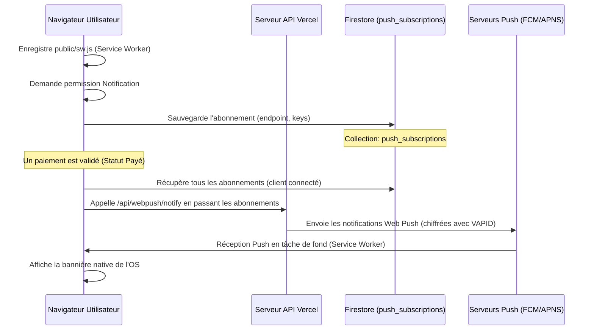

# 📱 Guide d'Intégration & Contexte des Notifications Push

Ce document résume l'architecture complète, la configuration de production (Vercel/Firestore) et les étapes de test pour le système de **Notifications Push en Arrière-plan (Web Push API)**. Il sert de guide de contexte pour que tout futur assistant IA ou développeur comprenne instantanément l'état d'avancement du projet.

---

## 🛠️ Architecture du Système Web Push

Le système permet de diffuser des alertes natives (bannières de l'OS) en temps réel à tous les utilisateurs enregistrés, même si leur téléphone est en veille ou si leur navigateur est fermé.



### 1. Composants Clés du Code
* **Service Worker (`public/sw.js`)** : Script tournant en tâche de fond pour écouter l'événement `push` du système d'exploitation et afficher la bannière native (`self.registration.showNotification`). Gère également le clic sur la notification pour ouvrir l'application.
* **Enregistrement Automatique (`src/components/AuthGuard.tsx`)** : Dès qu'un utilisateur authentifié charge l'application, le Service Worker est automatiquement enregistré si l'appareil est compatible.
* **Interface Paramètres (`src/app/settings/page.tsx`)** : Permet à l'utilisateur d'activer/désactiver le push sur son appareil actuel (avec création directe du document dans la collection `push_subscriptions` sur Firestore) et de tester l'envoi de la notification.
* **Saisie de Remarque Intelligente (`src/components/ClientRemarkModal.tsx`)** :
  * Intègre le sélecteur de mode de règlement (Versement, Espèce, Traite, Chèque) pour les paiements partiels et totaux.
  * Formule automatiquement le texte de la remarque pour l'opérateur (ex: *Payé : Règlement total par chèque de 450,000 TND*).
  * Enregistre un document dans `pending_payments` avec `status: 'pending'` dès qu'un paiement complet ou partiel est effectué.
* **API de Publication (`src/app/api/cron/payment-notifications/route.ts`)** : Cron job qui récupère les paiements en attente, met à jour leur statut, et envoie les bannières push aux abonnés ainsi qu'un webhook (Discord/Slack).
* **API de Test (`src/app/api/webpush/test-notification/route.ts`)** : Envoie une notification instantanée à l'appareil de l'utilisateur pour vérifier la connectivité.
* **API de Secours VAPID (`src/app/api/webpush/generate-vapid/route.ts`)** : Génère des clés VAPID en cas de besoin.

---

## 🔑 Variables d'Environnement (Vercel Production)

Pour que la signature cryptographique des notifications fonctionne, les variables d'environnement suivantes doivent être définies dans votre projet Vercel :

| Variable | Description | Valeur Concrète |
| :--- | :--- | :--- |
| `NEXT_PUBLIC_VAPID_PUBLIC_KEY` | Clé publique pour l'abonnement du navigateur | *Clé publique générée* |
| `VAPID_PRIVATE_KEY` | Clé privée pour signer les messages push | *Clé privée générée* |
| `VAPID_SUBJECT` | URI de contact requis par les serveurs push | `mailto:mahdigouia@gmail.com` |
| `PAYMENT_WEBHOOK_URL` | Webhook de chat (optionnel) | *URL Discord / Slack* |

*Note : Les routes d'API backend donnent la priorité absolue à ces variables d'environnement pour des performances optimales et pour éviter tout blocage lié aux règles de sécurité Firestore.*

---

## 🧪 Guide de Test : Scénario Réel de Paiement

Voici comment tester le flux complet de notification :

### Exemple Concret : Encaissement de "369 EMBALLAGE"

#### 1. Saisie du paiement (Par l'utilisateur A) :
1. Connectez-vous sur votre appareil.
2. Allez sur l'onglet **Clients** et ouvrez le suivi de relance du client **`369 EMBALLAGE`**.
3. Sélectionnez le statut **Payé** (ou *Payé Partiellement*).
4. Choisissez le mode de règlement **Chèque** (ou *Espèce*).
5. Saisissez le montant (ex: `400`). Le texte se formule automatiquement : `"Payé : Règlement total par chèque de 400,000 TND."`
6. Cliquez sur **Enregistrer**.
   * *Résultat technique* : Une remarque est créée, et un document `status: "pending"` est ajouté dans la collection Firestore `pending_payments`.

#### 2. Déclenchement de la notification (Simulé ou Cron) :
Puisque le Cron Job s'exécute quotidiennement sur le compte gratuit Hobby de Vercel, vous pouvez forcer l'envoi immédiat en appelant l'URL suivante dans votre navigateur (ou via un outil comme Postman) :
```text
https://gesstion-clients.vercel.app/api/cron/payment-notifications
```
*   *Résultat technique* :
    1. L'API backend détecte le paiement en attente de `369 EMBALLAGE`.
    2. Elle marque le document comme `sent`.
    3. Elle diffuse le message Web Push chiffré à tous les terminaux enregistrés dans `push_subscriptions`.
    4. Elle publie un résumé sur votre webhook Discord/Slack.

#### 3. Réception de l'alerte (Par l'utilisateur B) :
L'utilisateur B (qui peut être vous sur un autre appareil, ou un collègue ayant activé les notifications push) reçoit instantanément une alerte native sur son écran :
*   **Titre** : `Nouveau Paiement Recouvré ! 💰`
*   **Corps** : `[Utilisateur A] a marqué le client 369 EMBALLAGE comme PAYÉ (Règlement total par chèque de 400,000 TND).`
*   **Comportement** : Cliquer sur la notification ouvre l'application Chrome et l'oriente directement sur l'onglet clients.

---

## 🎯 Prochaines étapes de développement

1. **Rapport d'activité quotidien** : Le Cron job actuel peut être enrichi pour envoyer un e-mail de synthèse de fin de journée en plus du push instantané.
2. **Historique des push** : Créer un onglet "Centre de notifications" dans les paramètres pour consulter les 20 dernières alertes reçues si l'utilisateur a manqué les bannières systèmes.
